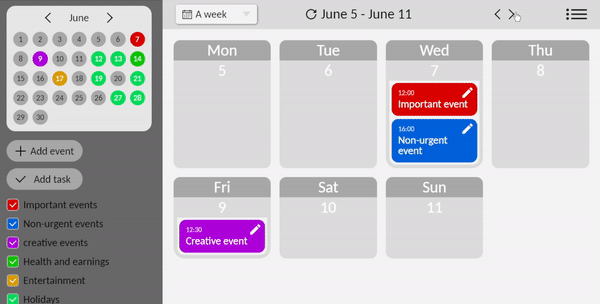
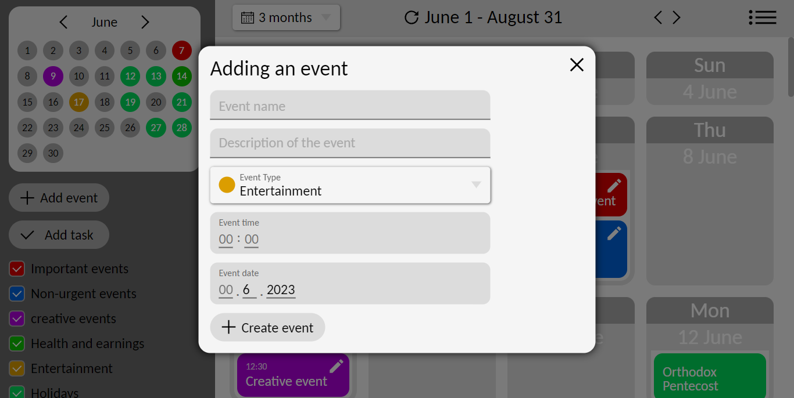
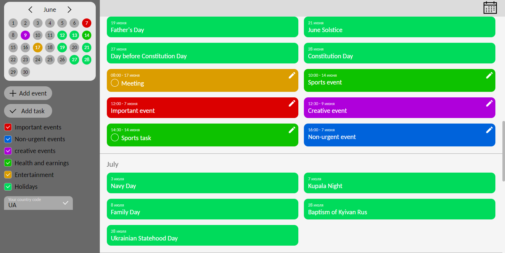

## Event Planner Calendar

**Event Planner Calendar** is a JavaScript application for creating your events, assigning tasks and viewing national holidays in your country using a calendar. 

I made this project to improve my JavaScript skills and practice building real applications. I created the HTML markup in Russian, so **if you don't understand Russian translate the Web page using Google Translate.**

To run the application, [download the source code](https://github.com/IhorAntiukhov/event-planner-calendar/archive/refs/heads/main.zip) and open the index.html file.

## Project work examples

### Changing a calendar period

### Scrolling calendar with 3 month scale

### Jump to a date through the side calendar

### Adding an event

### Display all events in the list

### All app features

+ Adding events or tasks
    + You can specify the name and description of the event.
    + You can choose one of the event types. **Events of each type have different colors.**
    + You can specify the time and date of the event. **Events can be dragged from one date to another using the cursor.**
+ Top panel features
    + Change the number of dates shown on the calendar.
    + Switching between periods of the calendar *(scrolling the calendar left-right).*
    + Displaying user-added events and holidays in the list.
+ Sidebar features
    + Mini calendar
        + The color of the date on the side calendar depends on what type of events are added for that day.
        + Jump to a date in the main *(big)* calendar by clicking on a date in the side calendar.
    + Add a new event or task.
    + Filter events by their types *(you can hide events of the same type by unchecking the appropriate checkbox).*
+ Holidays
    + I used the [Holidays API](https://holidayapi.com/) to get the national holidays in a specific country.
    + **To display national holidays in your country, enter your country code in the input field at the bottom of the sidebar.**